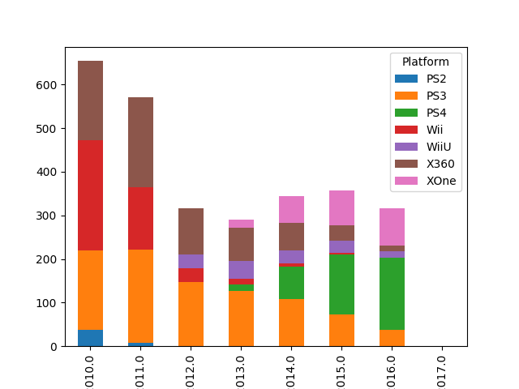
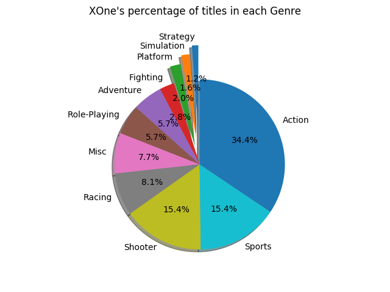
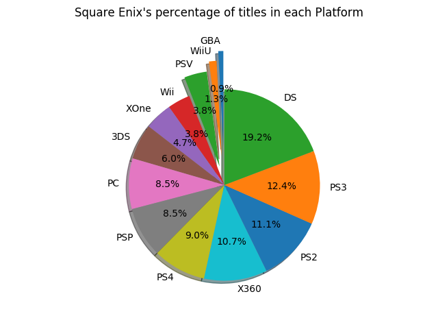
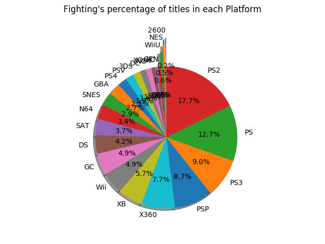

# vg-charts
This program is for manipulating video game stats

## [Bar Chart of Console Releases by Year (2010+)](./recent_console_releases_by_year.py)

## [Pie Chart of Percentage of each Genre for Xbox One Games]

## [Pie Chart of Percentage of Square Enix Games by Platform]

> vg-chart-generator --filtercol Publisher --filterval "Square Enix" --groupby Platform --chart --outfile square_enix_games_by_platform.png

## [Pie Chart of Percentage of Fighting Games by Platform]

> vg-chart-generator --filtercol Genre --filterval Fighting --groupby Platform --chart --outfile fighting_by_platform.png